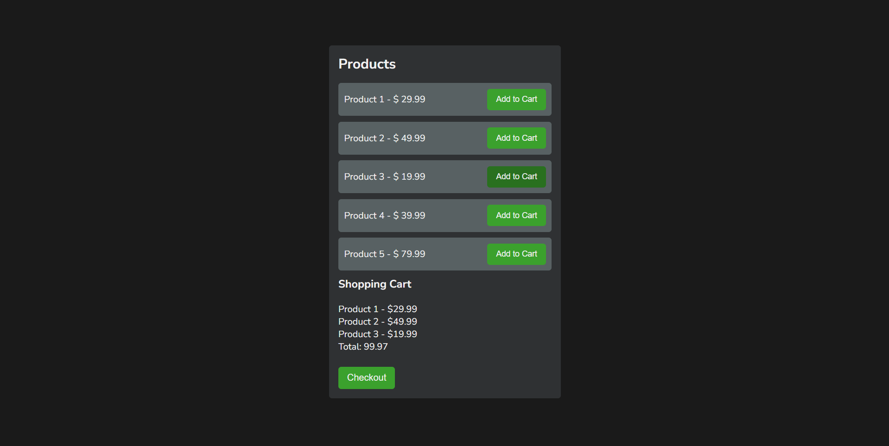
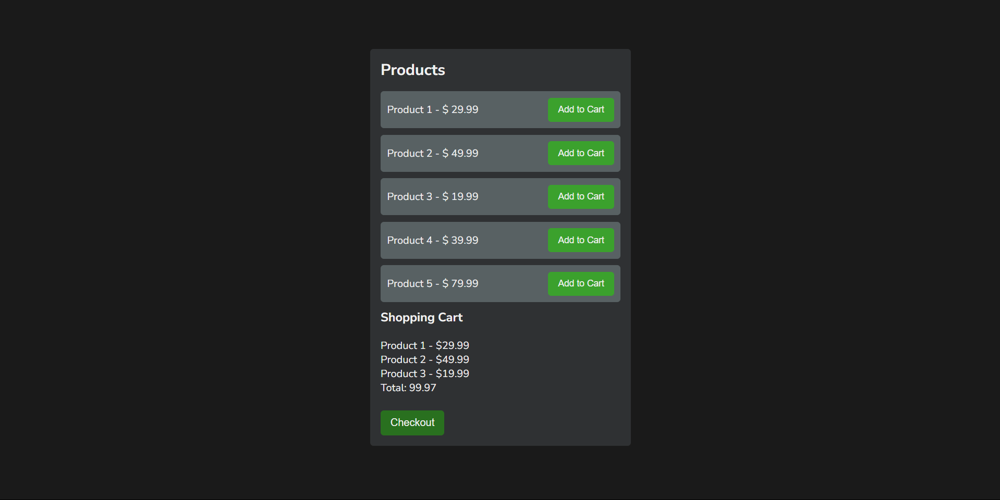
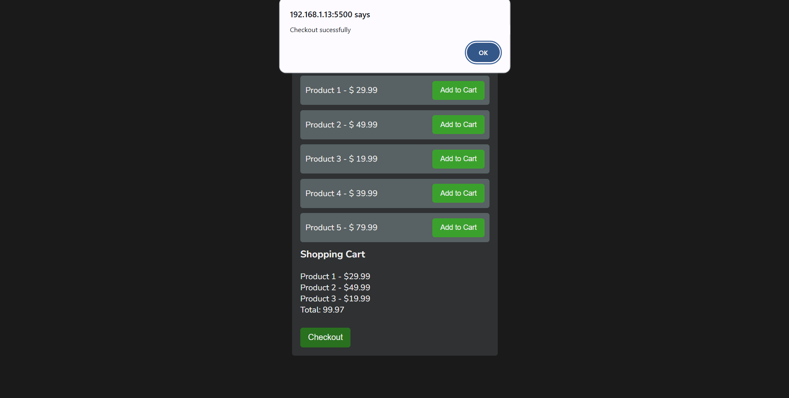

# 🛒 Product Cart Page

A simple product cart application that allows users to add products to a cart and proceed to checkout. This project is designed for ease of use and serves as a great starting point for building e-commerce applications.

---

## ✨ Features

- **Add Products**: Users can add products to the cart.
- **Checkout**: Proceed to checkout after adding products to the cart.

---

## 🛠️ Technologies Used

- **HTML5**: For structuring the page content.
- **CSS3**: For styling the user interface.
- **JavaScript**: For dynamic functionality such as adding and checking out products.

---

## 🎯 How It Works

1. **User Interface of the Application**  
   

2. **Add a Product to the Cart**  
   

3. **Multiple Products Added to the Cart**  
   

4. **Checkout**  
   

5. **Checkout Successful Alert**  
   

---

## 📬 Contact

For any questions or feedback, feel free to reach out:

- **Email**: your-email@example.com
- **GitHub**: [your-username](https://github.com/your-username)
